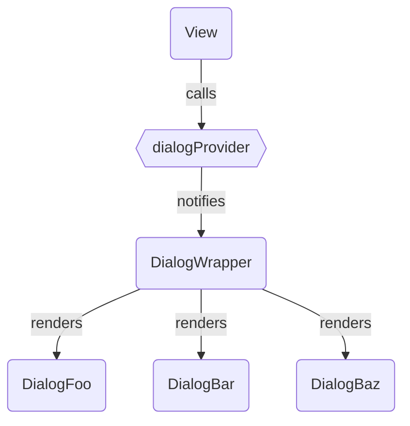
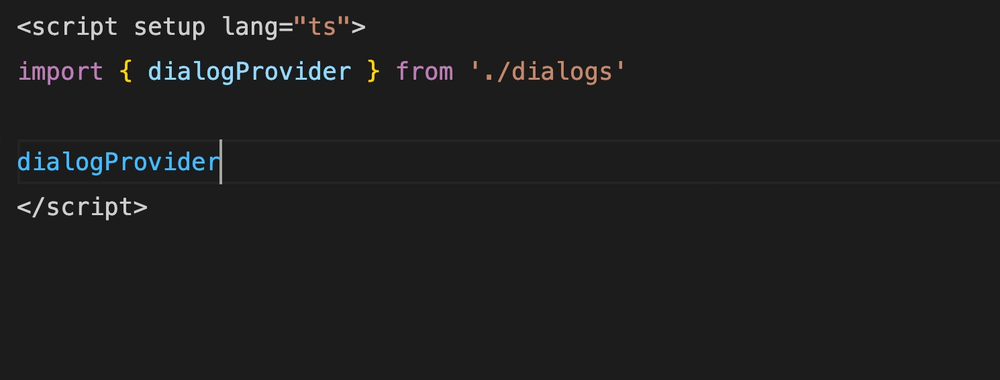

# App Wide (Modal) Dialogs with Vue

Vue gives developers a lot of power and flexibility to create reusable components and logic. This is part of the reason developers ❤️ Vue, but sometimes leads to hard decisions on which pattern to choose for a certain use case. In this article I'll shed some light on a use case that took us a bit of time to get right:

**Modal dialogs that are shared accross the whole application** (e.g. confirmation dialogs)

## ⏱ Short On Time?

> Steal with pride from the [example app](https://github.com/visualjerk/visualjerk-blog/tree/main/examples/vue-app-wide-modal-dialogs)

## 📝 Minimum Requirements

Before diving into the details, let's take a look at what we want to achieve.

A modal dialog

1. can be triggered from multiple places
2. can receive props
3. can provide events
4. is rendered only once when used in multiple places

## 💎 Developer Experience

In addition to the minimum requirements we would also like to get a great DX by

1. providing a simple api
2. offering type safety for a dialog's accepted props and events

## 📟 Defining the API

Usually a good way to start building a new component is by thinking about how you want to use it. For the purposes of that let's take a look at a concrete example. Before a user deletes an entity, she is asked to confirm this action.

Without the confirmation part our code might look like this:

```vue
<template>
  ...
  <AppButton variant="danger" @click="handleDelete">Delete</AppButton>
  ...
</template>

<script setup lang="ts">
...
async function handleDelete() {
  await api.delete(props.id)
  router.push('/overview')
}
...
</script>
```

After applying our dream dialog api we might end up with:

```ts
import { dialogs } from '@src/dialogs'
...
async function doDelete() {
  await api.delete(props.id)
  router.push('/overview')
}

// ✅ provide a simple api
// ✅ can be triggered from multiple places
dialogs.open('confirm', {
  // ✅ can receive props
  title: `Do you really want to delete ${props.name}?`,
  // ✅ can provide events
  onConfirm: () => doDelete(),
})
</script>
```

This already fulfills #1 to #3 of our minimum requirements, as well as #1 of our DX wishes.

## 🪜 Planning the Architecture

Next let's create a proper architecture, which supports #4 of our minimum requirements. In order to only render a single dialog instance we ended up with something like this:



The `View` calls the `dialogProvider`, which in turn notifies the `DialogWrapper`. The `DialogWrapper` itself is responsible for rendering a single dialog at a time.

::: info
Note, that in this case we use `View` as a substitute for any place that needs to use a dialog. So it can be an actual `RouterView`, another component or even a use hook.
:::

## 🧱 Creating the Dialog Provider

Based on the above architecture, our `dialogProvider` is hardly more than a subscription service for dialogs. For the sake of breavity, we use `EventTarget` to implement it:

::: code-group

```ts [dialogs/dialog-provider.ts]
const DIALOG_OPEN_EVENT = 'DIALOG_OPEN_EVENT'
const eventBus = new EventTarget()

export type DialogEventPayload = {
  kind: string
  context: Record<string, unknown>
}

export const dialogProvider = {
  open(kind: string, context: Record<string, unknown>) {
    eventBus.dispatchEvent(
      new CustomEvent<DialogEventPayload>(DIALOG_OPEN_EVENT, {
        detail: {
          kind,
          context,
        },
      })
    )
  },
  subscribe(handler: (payload: DialogEventPayload) => void) {
    function handleEvent(event: CustomEvent<DialogEventPayload>) {
      handler(event.detail)
    }

    eventBus.addEventListener(DIALOG_OPEN_EVENT, handleEvent as EventListener)
    return () =>
      eventBus.removeEventListener(
        DIALOG_OPEN_EVENT,
        handleEvent as EventListener
      )
  },
}
```

:::

On the surface the `dialogProvider` offers two methods:

- `open` will be used inside our views to open a new dialog
- `subscribe` will be used inside the `DialogWrapper` to get notified about opening a new dialog

## 🧱 Creating the Dialog Wrapper

Now we create the `DialogWrapper` which is responsible for rendering dialogs, whenever it gets notified by the `dialogProvider`.

::: code-group

```vue [dialogs/dialog-wrapper.vue]
<template>
  <component
    v-if="dialogComponent"
    :is="dialogComponent"
    v-bind="dialogBindings"
  />
</template>

<script setup lang="ts">
import { onBeforeUnmount, ref, markRaw } from 'vue'
import { dialogProvider } from './dialog-provider'
import { DIALOG_COMPONENTS } from './components'

const dialogComponent = ref()
const dialogBindings = ref()

function onClose() {
  dialogComponent.value = null
  dialogBindings.value = null
}

const unsubscribe = dialogProvider.subscribe(({ kind, context }) => {
  dialogComponent.value = markRaw(DIALOG_COMPONENTS[kind])
  dialogBindings.value = {
    ...context,
    onClose,
  }
})
onBeforeUnmount(unsubscribe)
</script>
```

```ts [dialogs/components/index.ts]
import type { Component } from 'vue'

export const DIALOG_COMPONENTS: Record<string, Component> = {}
```

:::

This component is pretty straightforward. It utilizes Vue's `component` to render a dialog component of a certain `kind`. It also binds the provided context alongside an `onClose` handler to the dialog component.

Note that we import a record of `DIALOG_COMPONENTS`, which is an empty object for now. This is the place where we will register the actual dialog components.

## 🧱 Adding a Dialog Component

Our next step is to add an actual dialog component. Let's stick with the example from above and create a `ConfirmDialog`:

::: code-group

```vue [dialogs/components/confirm-dialog.vue]
<template>
  <AppDialog @close="handleCancel">
    <template #title>
      {{ title }}
    </template>
    <template #actions>
      <AppButton @click="handleCancel">Cancel</AppButton>
      <AppButton @click="handleConfirm" variant="primary">Confirm</AppButton>
    </template>
  </AppDialog>
</template>

<script setup lang="ts">
import AppDialog from '../../components/app-dialog.vue'
import AppButton from '../../components/app-button.vue'

defineProps<{
  title: string
}>()

const emit = defineEmits<{
  (e: 'close'): void
  (e: 'cancel'): void
  (e: 'confirm'): void
}>()

function handleCancel() {
  emit('cancel')
  emit('close')
}

function handleConfirm() {
  emit('confirm')
  emit('close')
}
</script>
```

:::

The one thing that all dialog components need to implement is a `close` event. This is used by the `DialogWrapper` to close the dialog and reset its bindings.

In addition this specific dialog emits a `cancel` and `confirm` event. It also requires a `title` prop. All of these can be provided by the context of a `DialogEvent` and are bound to the component by the `DialogWrapper`.

## 🧱 Register the Confirm Dialog

Now we register the `ConfirmDialog` in our `DIALOG_COMPONENTS`, so the `DialogWrapper` knows about its existence:

::: code-group

```ts [dialogs/components/index.ts]
import type { Component } from 'vue'
import { defineAsyncComponent } from 'vue'

export const DIALOG_COMPONENTS: Record<string, Component> = {
  confirm: defineAsyncComponent(() => import('./confirm-dialog.vue')),
}
```

:::

Note that we use Vue's `defineAsyncComponent` to enable code splitting and ensure a dialog is only loaded on demand. This is considered best practice, as some dialogs might not be needed at all during a user session.

## 🧱 Using Dialogs in a View

With all the hard work done, we can finally reap the rewards and use a dialog inside our view (in this simple example just the `App.vue`).

::: code-group

```vue [App.vue]
<script setup lang="ts">
import { ref } from 'vue'
import { DialogWrapper, dialogProvider } from './dialogs'
import AppButton from './components/app-button.vue'

const confirmed = ref(false)

function handleSeriousAction() {
  dialogProvider.open('confirm', {
    title: 'Do you really want to delete this?',
    onConfirm: () => {
      confirmed.value = true
    },
    onCancel: () => {
      confirmed.value = false
    },
  })
}
</script>

<template>
  <div>
    <h2>{{ confirmed ? 'Action Confirmed' : 'Unconfirmed' }}</h2>
    <AppButton @click="handleSeriousAction" variant="danger">
      Do Something Serious
    </AppButton>
  </div>
  <DialogWrapper />
</template>
```

:::

While the `DialogWrapper` should be kept on root level, the `dialogProvider` can be used wherever we please. Adding new kinds of dialogs is a breeze, as it just requires creating a simple dialog component and adding it to `DIALOG_COMPONENTS`.

But there is one last beast to slay.

## 🔮 Improving Developer Experience with Type Safety

By making our `open` method generic, we can add type safety and intellisense to it:

::: code-group

```ts [dialogs/confirm-provider.ts]
import type { ComponentProps } from '../types'
import type { DIALOG_COMPONENTS } from './components'

type DialogKind = keyof typeof DIALOG_COMPONENTS
type DialogContext<TKind extends DialogKind> = Omit<
  ComponentProps<typeof DIALOG_COMPONENTS[TKind]>,
  'onClose'
>

export type DialogEventPayload<TKind extends DialogKind = DialogKind> = {
  kind: DialogKind
  context: DialogContext<TKind>
}

const DIALOG_OPEN_EVENT = 'DIALOG_OPEN_EVENT'
const eventBus = new EventTarget()

export const dialogProvider = {
  open<TKind extends DialogKind>(kind: TKind, context: DialogContext<TKind>) {
    eventBus.dispatchEvent(
      new CustomEvent<DialogEventPayload>(DIALOG_OPEN_EVENT, {
        detail: {
          kind,
          context,
        },
      })
    )
  },
  subscribe(handler: (payload: DialogEventPayload) => void) {
    function handleEvent(event: CustomEvent<DialogEventPayload>) {
      handler(event.detail)
    }

    eventBus.addEventListener(DIALOG_OPEN_EVENT, handleEvent as EventListener)
    return () =>
      eventBus.removeEventListener(
        DIALOG_OPEN_EVENT,
        handleEvent as EventListener
      )
  },
}
```

```ts [types.d.ts]
import type { AllowedComponentProps, Component, VNodeProps } from 'vue'

export type ComponentProps<C extends Component> = C extends new (
  ...args: any
) => any
  ? Omit<
      InstanceType<C>['$props'],
      keyof VNodeProps | keyof AllowedComponentProps
    >
  : never
```

:::

The important part here is the generic `DialogContext` type. It takes a `DialogKind`, which is the key of our `DIALOG_COMPONENTS` record. It then gets the props of the component that is stored under this key and omits `onClose`, as this method should only be used inside of `DialogWrapper`.

Now TypeScript will yell at us, if we miss a required prop. In addition we get intellisense for a dialog's context:



And that's it. We have created a solid foundation for dialogs that can be used application wide. We have also ensured it is type safe and offers a straightforward way to extend.

I hope you enjoyed this article and would love to read your thoughts about the approach. Also I am always curious to see other solutions. Feel free to leave a comment.

❤️ Thanks for reading!

## 📖 Recommended Articles

- [Modal & Nonmodal Dialogs: When (& When Not) to Use Them](https://www.nngroup.com/articles/modal-nonmodal-dialog/)
