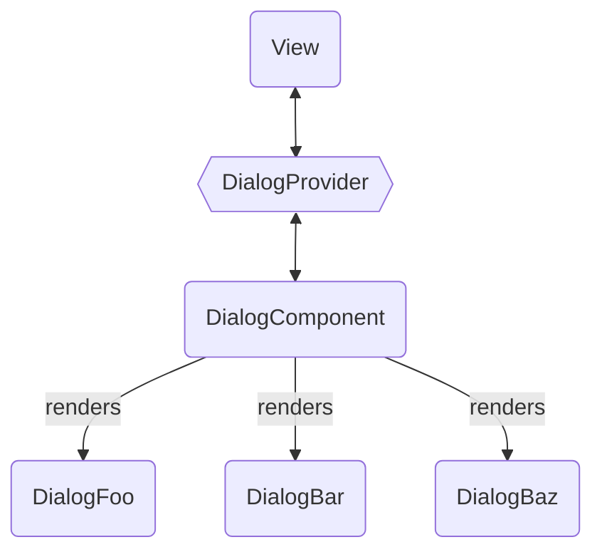
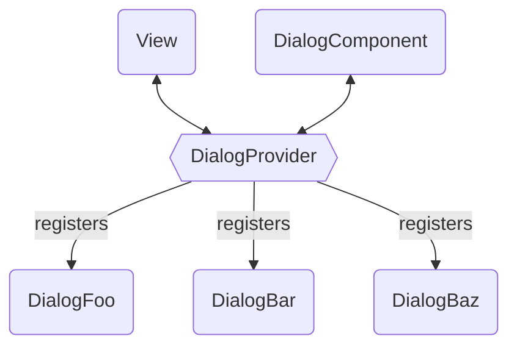

# App Wide (Modal) Dialogs with Vue

Vue gives developers a lot of power and flexibility to create reusable components and logic. This is part of the reason developers ♥️ Vue, but sometimes leads to hard decisions on which pattern to choose for a certain use case. In this article I'll shed some light on a use case that took us a bit of time to get right:

**Modal dialogs that are shared accross the whole application** (e.g. confirmation dialogs)

## Short On Time?

> Steal with pride from the [Stackblitz Example](#)

## 📝 Minimum Requirements

Before diving into the details, lets take a look at what we want to achieve.

The modal dialog

1. can be triggered from multiple places
2. is able to receive context specific variables
3. is able to provide feedback to the place where it was triggered
4. is rendered only once even if used in multiple places

## 💎 Developer Experience

In addition to the minimum requirements we would also like to get a great DX with

1. providing a simple api
2. offering type safety for a dialog's accepted context and feedback

## Defining the API

Usually a good way to start building a new component is by thinking about how you want to use it. Let's look at a concrete example. Before a user deletes an entity, she is asked to confirm this action.

Without the confirmation our code might look like this:

```vue
<template>
  ...
  <AppButton variant="danger" @click="handleDelete">Delete</AppButton>
  ...
</template>

<script setup lang="ts">
...
async function handleDelete() {
  await api.delete(props.id)
  router.push('/overview')
}
...
</script>
```

After applying our dream dialog api we might end up with:

```ts
import { dialogs } from '@src/dialogs'
...
async function doDelete() {
  await api.delete(props.id)
  router.push('/overview')
}

function handleDelete() {
  dialogs.show('confirm', {
    title: `Do you really want to delete ${props.name}?`,
    onConfirm: () => doDelete(),
  })
}
</script>
```

Upon closer look we can derive a new distinct pieces this api consists of:

```ts
dialogs.show('confirm', { // dialog kind
  // context
  title: `Do you really want to delete ${props.name}?`,
  // feedback
  onConfirm: () => doDelete(),
})
```

With this api, we can already check #1 to #3 of our minimum requirements.

## Planning the Architecture

Next let's create a proper architecture, which supports #4 of our minimum requirements. In order to only render a single dialog instance we ended up with something like this:



## Creating the Dialog Provider

Based on the above architecture, our **dialog provider** is hardly more than a subscription service for dialogs. For the sake of breavity, we use `EventTarget` to implement it:

::: code-group

```ts [dialogs/dialog-provider.ts]
const DIALOG_OPEN_EVENT = 'DIALOG_OPEN_EVENT'

class DialogProvider extends EventTarget {
  open(kind: string, context: Record<string, unknown>) {
    this.dispatchEvent(new CustomEvent(DIALOG_OPEN_EVENT, {
      details: context
    }))
  }
}
```

:::

## Creating the Dialog Component

## Improving Developer Experience with Typesafety

TBD: Typesafety



## Handling Errors

## Further Reading

- [Modal & Nonmodal Dialogs: When (& When Not) to Use Them](https://www.nngroup.com/articles/modal-nonmodal-dialog/)
